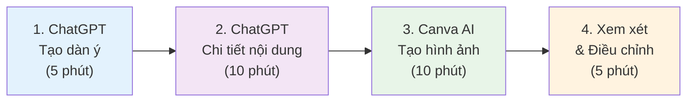
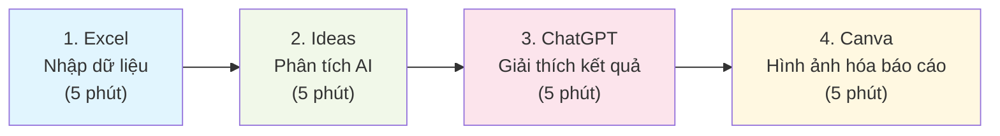

# 📋 Bảng tóm tắt nhanh - AI cho Giáo viên

## ⚡ Bắt đầu nhanh trong 15 phút

### 🎯 Bước 1: Tạo tài khoản (5 phút)
```markdown
✅ ChatGPT: chat.openai.com (Dùng Gmail)
✅ Canva: canva.com (Chọn "Education") 
✅ Google Bard: bard.google.com
✅ Bing Chat: bing.com/chat

💡 Mẹo: Dùng 1 email Google cho tất cả để dễ quản lý
```

### 🚀 Bước 2: Thử nghiệm đầu tiên (5 phút)
```markdown
ChatGPT lệnh đầu tiên:
"Tôi là giáo viên [môn học] lớp [X]. Hãy tạo 5 câu hỏi trắc nghiệm về [chủ đề] với đáp án và giải thích."

Canva AI lệnh:
"Poster giáo dục về [chủ đề], đầy màu sắc, phù hợp cho học sinh lớp [X]"
```

### 🎓 Bước 3: Áp dụng ngay (5 phút)
```markdown
- Dùng kết quả ChatGPT cho tiết học hôm nay
- Tải hình Canva làm tài liệu hỗ trợ hình ảnh
- Chia sẻ với đồng nghiệp để lấy phản hồi
```

## 📝 Mẫu lệnh thường dùng

### 🎯 Soạn giáo án nhanh
```markdown
Mẫu chuẩn:
"Tôi là giáo viên [MÔN] lớp [LỚP]. Tạo giáo án 45 phút cho bài '[TÊN BÀI]' bao gồm:
- Mục tiêu học tập rõ ràng
- Thời gian chi tiết từng hoạt động  
- 3 ví dụ thực tế
- Hoạt động nhóm 10 phút
- 5 câu hỏi kiểm tra
- Bài tập về nhà 3 mức độ
Phù hợp học sinh Việt Nam, ngôn ngữ dễ hiểu."

Ví dụ cụ thể:
"Tôi là giáo viên Toán lớp 8. Tạo giáo án 45 phút cho bài 'Phương trình bậc nhất' bao gồm..."
```

### 📊 Tạo câu hỏi kiểm tra
```markdown
Trắc nghiệm:
"Tạo 10 câu hỏi trắc nghiệm về [chủ đề] cho lớp [X]:
- 4 câu dễ (nhận biết) 
- 4 câu TB (hiểu)
- 2 câu khó (vận dụng)
Mỗi câu 4 lựa chọn, có đáp án và giải thích."

Tự luận:
"Tạo 5 câu hỏi tự luận về [chủ đề] với rubric chấm điểm chi tiết."
```

### 🎨 Tạo hình ảnh giáo dục
```markdown
Mẫu Canva AI:
"[Chủ đề], minh họa giáo dục, [phong cách], phù hợp cho học sinh lớp [X], bối cảnh Việt Nam"

Ví dụ:
- "Hệ mặt trời, minh họa giáo dục, phong cách hoạt hình, phù hợp cho học sinh lớp 5"
- "Lịch sử Việt Nam, phong cách nghệ thuật truyền thống, phù hợp cho học sinh lớp 9"  
- "Hình học toán học, phong cách sơ đồ sạch sẽ, phù hợp cho học sinh lớp 7"
```

### 📋 Đánh giá học sinh
```markdown
Nhận xét cá nhân:
"Tạo nhận xét cho học sinh có đặc điểm: [mô tả]. Bao gồm:
- Điểm mạnh cụ thể
- Điểm cần cải thiện
- Gợi ý phương pháp học  
- Lời khuyến khích
Giọng điệu: tích cực, xây dựng, phù hợp tuổi [X]."

Báo cáo phụ huynh:
"Viết báo cáo tháng cho phụ huynh học sinh [tên/đặc điểm] bao gồm kết quả học tập, hành vi, đề xuất hỗ trợ."
```

## 🛠️ Công cụ AI - So sánh nhanh

| Công cụ | Miễn phí | Tốt nhất cho | Giới hạn | Rating |
|---------|----------|-------------|----------|---------|
| **ChatGPT** | ✅ GPT-4o mini | Văn bản, giáo án, Hỏi đáp | 40 tin nhắn/3h | ⭐⭐⭐⭐⭐ |
| **Google Bard** | ✅ Không giới hạn | Nghiên cứu, kiểm tra sự thật | Không | ⭐⭐⭐⭐ |
| **Bing Chat** | ✅ Không giới hạn | Tìm kiếm + AI | Không | ⭐⭐⭐⭐ |
| **Claude** | ✅ Có giới hạn | Văn bản dài, phân tích | 5 tin nhắn/h | ⭐⭐⭐⭐ |
| **Canva AI** | ✅ 25/tháng | Hình ảnh giáo dục | 25 ảnh | ⭐⭐⭐⭐⭐ |
| **Leonardo AI** | ✅ 150/ngày | Hình ảnh chất lượng cao | 150 tín dụng | ⭐⭐⭐⭐ |
| **Gamma** | ✅ 400 tín dụng | Slides tự động | 400/tháng | ⭐⭐⭐⭐ |
| **InVideo AI** | ✅ 10 phút | Video giáo dục | 10 phút/tháng | ⭐⭐⭐ |

## ⚡ Phím tắt và Hotkeys

### 💻 ChatGPT
```markdown
Ctrl + Enter: Gửi tin nhắn
↑ ↓: Duyệt lịch sử
Ctrl + /: Tìm trong cuộc trò chuyện
Ctrl + Shift + O: Cuộc trò chuyện mới
```

### 🎨 Canva
```markdown
Ctrl + D: Nhân đôi phần tử  
Ctrl + G: Nhóm các phần tử
Ctrl + Shift + G: Bỏ nhóm
T: Công cụ văn bản
R: Công cụ hình chữ nhật
C: Công cụ hình tròn
```

### 📊 Excel với AI
```markdown
Ctrl + E: Flash Fill
Alt + N + Z: Ideas panel
Ctrl + T: Tạo Bảng
F4: Lặp lại thao tác cuối
```

## 🎯 Quy trình làm việc nhanh

### 📚 Soạn 1 bài giảng hoàn chỉnh (30 phút)



### 📊 Phân tích dữ liệu học sinh (20 phút)



## 🚨 Khắc phục sự cố nhanh

### ❌ ChatGPT không hoạt động
```markdown
✅ Kiểm tra kết nối internet
✅ Làm mới trang web  
✅ Thử chế độ ẩn danh
✅ Dùng Bing Chat thay thế
✅ Xóa bộ nhớ đệm trình duyệt
```

### ❌ Kết quả AI không như mong muốn
```markdown
✅ Viết lệnh chi tiết hơn
✅ Thêm bối cảnh và ví dụ
✅ Chia nhỏ yêu cầu thành nhiều bước
✅ Thử công cụ AI khác
✅ Phản hồi và tinh chỉnh
```

### ❌ Hình ảnh AI không phù hợp
```markdown
✅ Thêm "giáo dục", "phù hợp cho lớp X"
✅ Chỉ định phong cách: hoạt hình, thực tế, sơ đồ
✅ Đề cập "bối cảnh Việt Nam" nếu cần
✅ Thử các lệnh khác nhau
✅ Dùng nhiều công cụ
```

## 📊 Chỉ số theo dõi hiệu quả

### ⏰ Tiết kiệm thời gian
```markdown
📝 Soạn giáo án: Trước [X] giờ → Sau [Y] giờ
🎨 Tạo hình ảnh: Trước [X] giờ → Sau [Y] giờ  
📊 Phân tích dữ liệu: Trước [X] giờ → Sau [Y] giờ
📋 Chấm bài: Trước [X] giờ → Sau [Y] giờ

📈 Tổng tiết kiệm: [X] giờ/tuần = [Y]% cải thiện
```

### 🎯 Chất lượng cải thiện
```markdown
Tự đánh giá (1-10):
- Chất lượng bài giảng: Trước [X] → Sau [Y]
- Student engagement: Trước [X] → Sau [Y]  
- Work-life balance: Trước [X] → Sau [Y]
- Confidence level: Trước [X] → Sau [Y]
```

## 🎓 Kỹ năng cần phát triển

### 📈 Beginner → Intermediate (1-2 tháng)
```markdown
✅ Viết prompts hiệu quả
✅ Sử dụng 3-5 AI tools thành thạo
✅ Tích hợp AI vào 50% bài giảng  
✅ Chia sẻ kinh nghiệm với đồng nghiệp
✅ Measure và track improvements
```

### 🚀 Intermediate → Advanced (3-6 tháng)  
```markdown
✅ Custom workflows cho môn học
✅ Train đồng nghiệp khác
✅ Research advanced AI tools
✅ Lead AI initiatives trong trường
✅ Speak tại conferences/workshops
```

## 📱 Mobile-friendly AI

### 📲 Apps nên cài
```markdown
📱 ChatGPT app (iOS/Android)
📱 Canva app (iOS/Android)  
📱 Google Assistant (built-in)
📱 Bing app (có AI chat)
📱 Notion (AI writing assistant)
```

### 💡 Tips sử dụng mobile
```markdown
✅ Voice input thay vì typing
✅ Save templates trong Notes app
✅ Use camera để scan documents
✅ Quick voice memos cho ideas  
✅ Share ngay với đồng nghiệp
```

## 🔒 Bảo mật và Privacy

### ⚠️ KHÔNG bao giờ nhập vào AI
```markdown
❌ Họ tên thật của học sinh
❌ Số điện thoại, địa chỉ cá nhân
❌ Điểm số kèm tên thật
❌ Thông tin gia đình riêng tư
❌ Passwords hoặc login info
```

### ✅ AN TOÀN khi sử dụng
```markdown
✅ "Học sinh A, B, C" thay vì tên thật
✅ "Lớp 9A có 35 em" (thông tin chung)
✅ "Một em học sinh có điểm yếu môn X"
✅ Dùng sample data thay real data
✅ Regular logout khỏi AI accounts
```

## 📞 Hỗ trợ khẩn cấp

### 🆘 Khi gặp khó khăn
```markdown
📧 Email: support@ai-teaching.vn
💬 Facebook: "AI cho Giáo viên VN" group  
📱 Telegram: @ai_education_vn
🎥 YouTube: "AI Teaching Vietnam" channel
📚 FAQ: [link đến trang FAQ chi tiết]
```

### 🤝 Peer Support
```markdown
👥 Tìm mentor trong cộng đồng
👥 Pair up với đồng nghiệp
👥 Join local AI education meetups  
👥 Participate online workshops
👥 Share và receive feedback
```

## 🎯 Goal Setting Template

### 📅 30-Day Challenge
```markdown
Week 1: ⚡ Setup và làm quen
- [ ] Tạo tất cả accounts cần thiết
- [ ] Thử 1 prompt mỗi ngày
- [ ] Tạo first AI-generated lesson plan

Week 2: 🚀 Tích hợp vào workflow  
- [ ] Dùng AI cho 50% lesson prep
- [ ] Tạo 10 educational images
- [ ] Share experience với 2 đồng nghiệp

Week 3: 📈 Scale và optimize
- [ ] Build personal template library
- [ ] Try 2 new AI tools
- [ ] Measure time savings

Week 4: 🏆 Leadership và sharing
- [ ] Train 1 đồng nghiệp
- [ ] Present results to principal
- [ ] Plan next month's goals
```

### 🎖️ Achievement Badges
```markdown
🥉 Bronze: First successful AI lesson plan
🥈 Silver: Save 5+ hours/week with AI
🥇 Gold: Train another teacher successfully  
💎 Platinum: Lead school-wide AI initiative
🏆 Champion: Recognized AI education expert
```

## 📋 Daily/Weekly Checklists

### 📅 Daily AI Usage (10 phút)
```markdown
Morning (5 phút):
- [ ] Check AI tools cho lesson của ngày
- [ ] Quick ChatGPT query cho any questions
- [ ] Generate 1 visual nếu cần

Evening (5 phút):  
- [ ] Reflect: AI help gì hôm nay?
- [ ] Plan: AI cần gì cho ngày mai?
- [ ] Share: 1 tip với đồng nghiệp
```

### 📊 Weekly Review (30 phút)
```markdown
- [ ] Calculate time saved với AI
- [ ] Review best prompts của tuần
- [ ] Try 1 new AI tool/feature
- [ ] Update template library  
- [ ] Plan improvements cho tuần sau
```

---

## 🚀 Quick Reference Cards

### 💬 ChatGPT Starter Pack
```markdown
Giáo án: "Tôi là GV [môn] lớp [X]. Tạo giáo án [bài] bao gồm..."
Câu hỏi: "Tạo [số] câu hỏi [loại] về [chủ đề] cho lớp [X]..."  
Giải thích: "Giải thích [khái niệm] cho học sinh lớp [X] bằng ví dụ đơn giản..."
Đánh giá: "Tạo rubric đánh giá [kỹ năng] với 4 mức độ..."
Phân tích: "Phân tích dữ liệu này và đưa ra insights: [data]..."
```

### 🎨 Canva AI Quick Start
```markdown
Poster: "[Topic] educational poster, colorful, grade [X]"
Diagram: "[Subject] diagram, clean lines, educational style"  
Timeline: "[Historical event] timeline, visual, easy to read"
Infographic: "[Data/concept] infographic, students friendly"
Worksheet: "[Subject] worksheet template, organized layout"
```

### 📊 Excel AI Formulas
```markdown
XLOOKUP: =XLOOKUP(lookup_value, lookup_array, return_array)
FILTER: =FILTER(array, criteria)
SORT: =SORT(array, sort_index, sort_order)  
UNIQUE: =UNIQUE(array)
SEQUENCE: =SEQUENCE(rows, columns, start, step)
```

---

**🎯 Nhớ rằng: AI là công cụ hỗ trợ, không thay thế sự sáng tạo và tương tác con người của giáo viên!**

**💪 Practice makes perfect - Hãy thực hành hàng ngày để thành thạo!**

**🤝 Share knowledge - Chia sẻ kiến thức để cộng đồng giáo viên cùng phát triển!**
