# Cheat Sheet

## Binary Search Algorithm Demo

```mermaid
flowchart TD
    A[Start: Array sorted, target value] --> B[Set left = 0, right = array.length - 1]
    B --> C{left <= right?}
    C -->|No| D[Target not found, return -1]
    C -->|Yes| E[Calculate mid = left + (right - left) / 2]
    E --> F{array[mid] == target?}
    F -->|Yes| G[Found! Return mid index]
    F -->|No| H{array[mid] < target?}
    H -->|Yes| I[Set left = mid + 1]
    H -->|No| J[Set right = mid - 1]
    I --> C
    J --> C
    
    style A fill:#e1f5fe
    style G fill:#c8e6c9
    style D fill:#ffcdd2
```

## Example Walkthrough

```mermaid
graph TD
    subgraph "Step 1: Initial"
        A1["Array: [1, 3, 5, 7, 9, 11, 13]<br/>Target: 7<br/>left=0, right=6, mid=3"]
    end
    
    subgraph "Step 2: Compare"
        B1["array[3] = 7<br/>7 == 7 ✓<br/>Found at index 3!"]
    end
    
    A1 --> B1
    
    style A1 fill:#fff3e0
    style B1 fill:#c8e6c9
```



Cheat sheet content...
