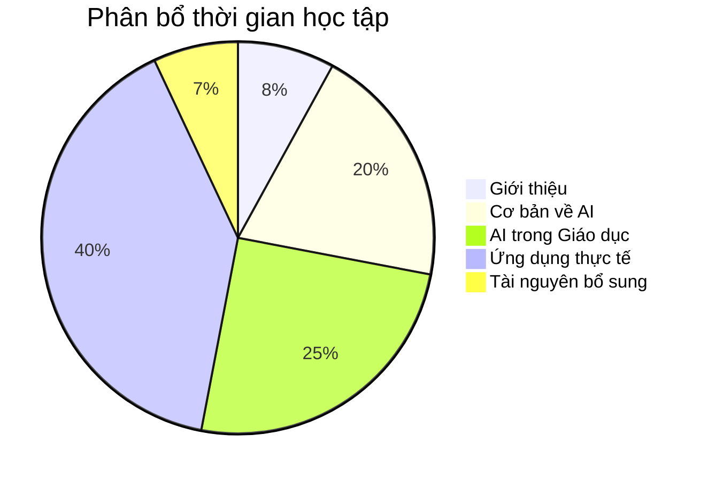

# 📋 1.3 Cấu trúc khóa học

## Tổng quan cấu trúc

Khóa học "Ứng dụng AI vào Giảng dạy" được thiết kế theo cấu trúc logic từ cơ bản đến nâng cao, đảm bảo người học có thể tiếp thu một cách hiệu quả nhất.

## 📚 Chi tiết từng phần

### 📖 Phần 1: Giới thiệu khóa học (3-4 giờ)

**Mục tiêu:** Tạo nền tảng và định hướng cho toàn bộ khóa học

**Nội dung:**
- **1.1 Mục tiêu học tập 🎯**
  - Định nghĩa rõ ràng những gì người học sẽ đạt được
  - Thiết lập expectation và motivation
  - Cách đánh giá tiến độ học tập

- **1.2 Đối tượng học 👥**
  - Xác định khóa học phù hợp với ai
  - Yêu cầu tiên quyết và chuẩn bị
  - Tự đánh giá mức độ phù hợp

- **1.3 Cấu trúc khóa học 📋**
  - Tổng quan toàn bộ curriculum
  - Lộ trình học tập chi tiết
  - Thời gian và milestone

- **1.4 Phương pháp học tập 📚**
  - Strategies để học hiệu quả
  - Cách tương tác với nội dung
  - Tips và best practices

### 🤖 Phần 2: Cơ bản về AI (8-10 giờ)

**Mục tiêu:** Xây dựng nền tảng kiến thức về AI

**Nội dung:**
- **2.1 AI là gì? 🧠**
  - Định nghĩa và khái niệm cơ bản
  - Sự khác biệt giữa AI, ML, Deep Learning
  - Ví dụ thực tế dễ hiểu
  - Myths và facts về AI

- **2.2 Lịch sử phát triển AI 📈**
  - Timeline phát triển AI
  - Các mốc quan trọng
  - AI trong giáo dục qua các thời kỳ
  - Lessons learned từ quá khứ

- **2.3 Các loại AI 🔍**
  - Narrow AI vs General AI
  - Supervised vs Unsupervised Learning
  - Natural Language Processing
  - Computer Vision và applications

- **2.4 Công cụ AI phổ biến 🛠️**
  - ChatGPT, Claude, Gemini
  - Canva AI, DALL-E, Midjourney
  - Educational AI tools
  - Criteria để chọn công cụ phù hợp

### 🎓 Phần 3: AI trong Giáo dục (10-12 giờ)

**Mục tiêu:** Hiểu sâu về ứng dụng AI trong lĩnh vực giáo dục

**Nội dung:**
- **3.1 Tổng quan AI trong giáo dục 📊**
  - Current state của AI trong education
  - Success stories và case studies
  - Market trends và statistics
  - Future predictions

- **3.2 Lợi ích của AI 💡**
  - Personalized learning
  - Automated grading và feedback
  - Content creation và curation
  - Administrative efficiency

- **3.3 Thách thức và giải pháp ⚡**
  - Privacy và data security
  - Digital divide
  - Teacher training needs
  - Ethical considerations

- **3.4 Xu hướng tương lai 🚀**
  - Emerging technologies
  - Predictions for next 5-10 years
  - Preparing for changes
  - Strategic planning

### 💼 Phần 4: Ứng dụng thực tế (15-18 giờ)

**Mục tiêu:** Thực hành sử dụng AI trong các tình huống giảng dạy cụ thể

**Nội dung:**
- **4.1 Soạn giáo án với AI 📝**
  - Template và frameworks
  - Step-by-step process
  - Quality assurance
  - Customization techniques

- **4.2 Tạo nội dung học tập 🎨**
  - Text content generation
  - Visual content creation
  - Interactive elements
  - Multimedia integration

- **4.3 Đánh giá và phản hồi 📊**
  - Automated assessment tools
  - Feedback generation
  - Progress tracking
  - Analytics và insights

- **4.4 Cá nhân hóa học tập 🎯**
  - Learning path customization
  - Adaptive content delivery
  - Student profiling
  - Intervention strategies

### 📚 Phần 5: Tài nguyên bổ sung (2-3 giờ)

**Mục tiêu:** Cung cấp tài liệu tham khảo và hỗ trợ liên tục

**Nội dung:**
- **5.1 Tham khảo nhanh 📋**
  - Cheat sheets cho các công cụ
  - Quick reference guides
  - Troubleshooting common issues
  - Keyboard shortcuts và tips

- **5.2 Câu hỏi thường gặp ❓**
  - Common questions và answers
  - Troubleshooting guide
  - Best practices Q&A
  - Community solutions

- **5.3 Tài nguyên và liên kết 🔗**
  - Recommended readings
  - Useful websites và tools
  - Communities và forums
  - Continuing education resources

## ⏰ Thời gian học tập

### Tổng thời gian: 40-50 giờ

### Lộ trình học tập đề xuất

**🏃‍♂️ Intensive (4 tuần)**
- 12-15 giờ/tuần
- Hoàn thành nhanh
- Phù hợp với người có thời gian tập trung

**🚶‍♂️ Regular (8 tuần)**
- 6-8 giờ/tuần  
- Cân bằng và bền vững
- Phù hợp với đa số người học

**🐌 Relaxed (12 tuần)**
- 3-4 giờ/tuần
- Thoải mái và sâu sắc
- Phù hợp với người bận rộn

## 📊 Phương pháp đánh giá

### Đánh giá quá trình (70%)
- **Participation (20%)**: Tham gia discussion, Q&A
- **Practical exercises (30%)**: Hands-on assignments
- **Mini projects (20%)**: Small implementation projects

### Đánh giá tổng kết (30%)
- **Final project (20%)**: Comprehensive AI implementation
- **Reflection essay (10%)**: Personal learning journey

### Criteria chấm điểm
- **Xuất sắc (90-100%)**: Mastery + Innovation
- **Tốt (80-89%)**: Proficient application
- **Khá (70-79%)**: Good understanding
- **Đạt (60-69%)**: Basic competency
- **Chưa đạt (<60%)**: Needs improvement

## 🎯 Learning outcomes chi tiết

Sau mỗi phần, người học sẽ có thể:

### Sau Phần 1:
- [ ] Nêu được mục tiêu cá nhân khi học AI
- [ ] Đánh giá được mức độ phù hợp của bản thân
- [ ] Lập được kế hoạch học tập cá nhân

### Sau Phần 2:
- [ ] Giải thích được AI là gì một cách đơn giản
- [ ] Phân biệt được các loại AI khác nhau
- [ ] Sử dụng được ít nhất 3 công cụ AI cơ bản

### Sau Phần 3:
- [ ] Phân tích được vai trò AI trong giáo dục
- [ ] Đánh giá được lợi ích và thách thức
- [ ] Dự đoán được xu hướng phát triển

### Sau Phần 4:
- [ ] Tạo được giáo án sử dụng AI
- [ ] Sản xuất được nội dung học tập với AI
- [ ] Thiết lập được hệ thống đánh giá AI-powered

### Sau Phần 5:
- [ ] Tự học được công cụ AI mới
- [ ] Giải quyết được vấn đề thường gặp
- [ ] Chia sẻ được kiến thức với người khác

## 🔄 Phương pháp cập nhật

Khóa học được cập nhật định kỳ:
- **Hàng tháng**: Thêm công cụ AI mới
- **Hàng quý**: Review và update content
- **Hàng năm**: Major revision dựa trên feedback

## 📱 Định dạng học tập

- **📖 Reading materials**: Texts, articles, research papers
- **🎥 Video tutorials**: Step-by-step guides, demonstrations  
- **🛠️ Hands-on labs**: Practical exercises với real tools
- **💬 Discussions**: Community interaction và Q&A
- **📝 Assignments**: Applied learning projects
- **🎮 Interactive elements**: Quizzes, simulations

---

**Tiếp theo**: [📚 Phương pháp học tập](/introduction/phuong-phap) - Học cách học hiệu quả nhất