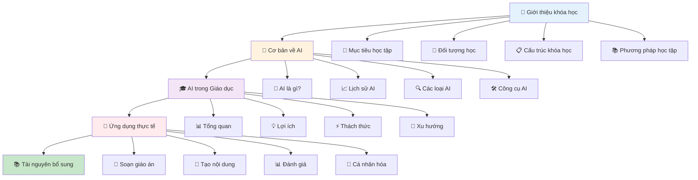
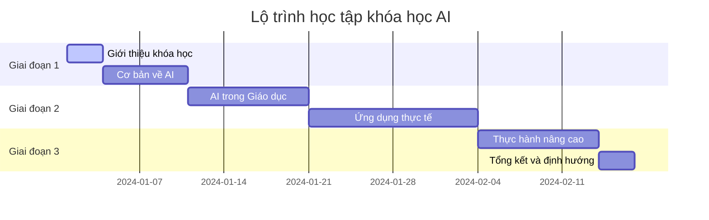

# 📖 Giới thiệu khóa học "Ứng dụng AI vào Giảng dạy"

## Chào mừng bạn đến với khóa học AI trong Giảng dạy! 🎓🤖

Khóa học này được thiết kế để cung cấp cho bạn kiến thức toàn diện về việc ứng dụng Trí tuệ Nhân tạo (AI) vào hoạt động giảng dạy và giáo dục.

## 🌟 Tổng quan khóa học

Trong thời đại số hóa hiện tại, AI đang trở thành một công cụ mạnh mẽ hỗ trợ các nhà giáo dục cải thiện chất lượng giảng dạy, tăng hiệu quả học tập và tạo ra những trải nghiệm học tập cá nhân hóa.

### 📋 Lộ trình học tập

### ⏱️ Thời gian học và Tiến độ

## 🎯 Những gì bạn sẽ học được

Sau khi hoàn thành khóa học này, bạn sẽ có khả năng:

1. **Hiểu rõ về AI**: Nắm vững các khái niệm cơ bản về Trí tuệ Nhân tạo
2. **Ứng dụng AI trong giảng dạy**: Biết cách sử ddụng AI để cải thiện chất lượng giảng dạy
3. **Sử dụng công cụ AI**: Thành thạo các công cụ AI phổ biến trong giáo dục
4. **Tạo nội dung học tập**: Sử dụng AI để tạo ra tài liệu, bài tập, và đề thi
5. **Cá nhân hóa học tập**: Áp dụng AI để tạo ra trải nghiệm học tập phù hợp với từng học sinh
6. **Đánh giá và phản hồi**: Sử dụng AI để đánh giá tiến độ học tập và cung cấp phản hồi

## 🚀 Hãy bắt đầu!

Chúng ta sẽ bắt đầu hành trình khám phá AI trong giảng dạy. Hãy tiếp tục với:

- [🎯 Mục tiêu học tập](/introduction/muc-tieu) - Hiểu rõ những gì bạn sẽ đạt được
- [👥 Đối tượng học](/introduction/doi-tuong) - Xem khóa học có phù hợp với bạn không
- [📋 Cấu trúc khóa học](/introduction/cau-truc) - Tổng quan về nội dung chi tiết
- [📚 Phương pháp học tập](/introduction/phuong-phap) - Tìm hiểu cách học hiệu quả nhất

---

*"Hành trình nghìn dặm bắt đầu từ bước chân đầu tiên. Hãy cùng nhau khám phá thế giới AI trong giáo dục!"* 🌟
