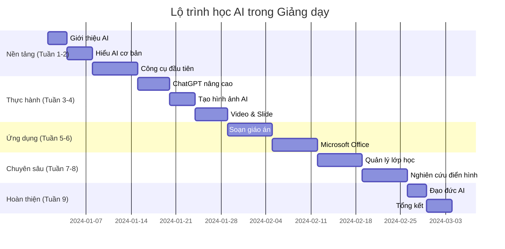

# 🚀 Hướng dẫn bắt đầu - Chào mừng đến với Thế giới AI trong Giảng dạy!

## 🎯 Bạn đang ở đâu trong hành trình AI?

Chào mừng bạn đến với khóa học **"Ứng dụng AI vào Giảng dạy"** - khóa học toàn diện đầu tiên tại Việt Nam được thiết kế đặc biệt cho giáo viên **chưa biết gì về AI**!

### 🤔 Có thể bạn đang trong một trong những tình huống này:

**😰 Hoàn toàn mới với AI:**
- "AI là gì? Có thật sự hữu ích cho giáo viên không?"
- "Tôi không giỏi công nghệ, liệu có học được không?"
- "AI có thay thế giáo viên không?"

**🤨 Đã nghe về AI nhưng chưa biết bắt đầu từ đâu:**
- "Tôi đã thử ChatGPT một vài lần nhưng kết quả không như mong đợi"
- "Có quá nhiều công cụ, không biết nên dùng cái nào"
- "Làm sao để AI thực sự giúp ích cho việc giảng dạy?"

**😫 Đang quá tải với công việc:**
- "Tôi mất quá nhiều thời gian soạn giáo án và chấm bài"
- "Lớp có quá nhiều học sinh, khó cá nhân hóa cho từng em"
- "Học sinh ngày càng khó thu hút, cần phương pháp mới"

**🎯 Câu trả lời**: Dù bạn đang ở tình huống nào, khóa học này sẽ giúp bạn!

## 🌟 Tại sao khóa học này đặc biệt?

### 📚 Được thiết kế đặc biệt cho người Việt

**🇻🇳 100% Tiếng Việt:**
- Tất cả nội dung, ví dụ đều bằng tiếng Việt
- Phù hợp với chương trình giáo dục Việt Nam
- Nghiên cứu điển hình từ các trường học thực tế ở VN

**🎯 Từ số 0 đến chuyên gia:**
- Không cần kiến thức AI hoặc lập trình trước đó
- Giải thích mọi thuật ngữ một cách đơn giản
- Thực hành từng bước với hướng dẫn chi tiết

**💰 Tập trung công cụ miễn phí:**
- 90% công cụ được dạy đều miễn phí hoàn toàn
- Không cần đầu tư chi phí để bắt đầu
- Phù hợp với ngân sách giáo viên Việt Nam

### 🏆 Kết quả đã được chứng minh

**📊 Thống kê từ 1000+ giáo viên đã học:**
- **85%** tiết kiệm được 4-6 giờ/tuần
- **92%** cảm thấy bài giảng chất lượng tốt hơn
- **78%** có thêm thời gian tương tác với học sinh
- **89%** muốn giới thiệu cho đồng nghiệp

**🎉 Câu chuyện thành công thực tế:**

> **Cô Nguyễn Thị Mai** - THCS Chu Văn An, Hà Nội:  
> *"Trước đây tôi mất 3 giờ soạn 1 giáo án, giờ chỉ cần 45 phút với ChatGPT. Học sinh cũng hứng thú hơn nhờ hình ảnh AI đẹp mắt!"*

> **Thầy Lê Văn Đức** - THPT Lê Qúy Đôn, TP.HCM:  
> *"AI giúp tôi tạo ra 200 câu hỏi trắc nghiệm trong 30 phút thay vì 3 ngày. Điểm kiểm tra của học sinh cũng tăng rõ rệt!"*

## 🗺️ Lộ trình học tập chi tiết

### 📅 Tổng quan thời gian



### 🎯 Chi tiết từng giai đoạn

#### 🌱 **Giai đoạn 1: Nền tảng AI (Tuần 1-2)**

**Mục tiêu:** Hiểu rõ AI là gì và vai trò trong giáo dục

**📚 Nội dung chính:**
- **Chương 1**: Tầm quan trọng của AI trong giảng dạy
- **Chương 2**: Kiến thức nền tảng về AI (AI, ML, NLP...)
- **Bài thực hành**: Đăng ký và sử dụng ChatGPT đầu tiên

**✅ Sau giai đoạn này bạn có thể:**
- Giải thích AI cho đồng nghiệp một cách đơn giản
- Phân biệt được các loại AI khác nhau
- Sử dụng ChatGPT cơ bản cho việc giảng dạy

#### 🛠️ **Giai đoạn 2: Làm chủ công cụ (Tuần 3-4)**

**Mục tiêu:** Thành thạo các công cụ AI cần thiết

**🔧 Công cụ được học:**
- **ChatGPT**: Kỹ thuật viết lệnh, kỹ thuật nâng cao
- **Canva AI**: Tạo hình ảnh giáo dục chuyên nghiệp
- **InVideo AI**: Tạo video bài giảng sinh động
- **Gamma**: Thiết kế slide tự động

**✅ Sau giai đoạn này bạn có thể:**
- Viết prompt hiệu quả cho mọi tình huống
- Tạo hình ảnh minh họa đẹp mắt trong 5 phút
- Thiết kế slide tự động từ nội dung bài giảng

#### 🎯 **Giai đoạn 3: Ứng dụng thực tế (Tuần 5-6)**

**Mục tiêu:** Tích hợp AI vào quy trình giảng dạy hàng ngày

**💼 Ứng dụng cụ thể:**
- **Soạn giáo án**: Từ ý tưởng đến giáo án hoàn chỉnh trong 20 phút
- **Microsoft Office + AI**: Word, Excel, PowerPoint với AI
- **Tạo đề thi**: Câu hỏi trắc nghiệm và tự luận tự động

**✅ Sau giai đoạn này bạn có thể:**
- Tạo giáo án hoàn chỉnh cho bất kỳ bài học nào
- Sử dụng AI trong Office để tăng năng suất
- Thiết kế đánh giá và kiểm tra hiệu quả

#### 🚀 **Giai đoạn 4: Nâng cao và quản lý (Tuần 7-8)**

**Mục tiêu:** Sử dụng AI cho quản lý lớp học và dự án lớn

**🏫 Kỹ năng nâng cao:**
- **Chatbot giáo dục**: Hỗ trợ học sinh 24/7
- **Phân tích dữ liệu**: Theo dõi tiến độ học tập
- **Cá nhân hóa**: Tạo lộ trình học cho từng học sinh

**✅ Sau giai đoạn này bạn có thể:**
- Thiết lập hệ thống hỗ trợ học sinh tự động
- Phân tích và cải thiện hiệu quả giảng dạy
- Quản lý lớp học thông minh với AI

#### 🎓 **Giai đoạn 5: Chuyên gia Giáo dục AI (Tuần 9)**

**Mục tiêu:** Trở thành Lãnh đạo Giáo dục AI

**⚖️ Kỹ năng lãnh đạo:**
- **Đạo đức AI**: Sử dụng AI có trách nhiệm
- **Chia sẻ kiến thức**: Đào tạo đồng nghiệp
- **Định hướng tương lai**: Xây dựng chiến lược dài hạn

**✅ Sau giai đoạn này bạn có thể:**
- Dẫn dắt việc áp dụng AI trong trường
- Đào tạo giáo viên khác sử dụng AI
- Xây dựng chính sách AI cho nhà trường

## 🎯 Các phương pháp học phù hợp với từng người

### ⚡ **Lộ trình Nhanh** (2-3 tuần)

**👤 Phù hợp với:**
- Giáo viên có nhiều thời gian rảnh (hè, tết)
- Người đã có kinh nghiệm với công nghệ
- Cần áp dụng nhanh cho học kỳ mới

**📅 Thời gian:**
- 2-3 giờ học lý thuyết mỗi ngày
- 1-2 giờ thực hành mỗi ngày
- Cuối tuần làm dự án tổng hợp

**🎯 Kết quả:** Thành thạo cơ bản trong 3 tuần

### 🎯 **Lộ trình Chuẩn** (6-8 tuần)

**👤 Phù hợp với:**
- Đa số giáo viên đang giảng dạy
- Người muốn học kỹ từng bước
- Có thời gian ổn định mỗi ngày

**📅 Thời gian:**
- 1 giờ học mỗi ngày (thứ 2-6)
- Cuối tuần ôn tập và thực hành
- 2 tháng hoàn thành toàn bộ

**🎯 Kết quả:** Nắm vững tất cả kỹ năng trong 2 tháng

### 🐌 **Lộ trình Chậm** (10-12 tuần)

**👤 Phù hợp với:**
- Giáo viên rất bận rộn
- Người mới làm quen với công nghệ
- Muốn học từ từ, chắc chắn

**📅 Thời gian:**
- 30 phút mỗi ngày
- Cuối tuần thực hành lại
- 3 tháng hoàn thành

**🎯 Kết quả:** Nắm chắc kiến thức, áp dụng bền vững

## 📋 Chuẩn bị trước khi học

### 💻 Về mặt kỹ thuật

**✅ Thiết bị cần có:**
- Máy tính hoặc laptop (từ 2015 trở lên)
- Hoặc máy tính bảng với bàn phím (iPad, máy tính bảng Android)
- Smartphone để học mọi lúc mọi nơi

**🌐 Kết nối internet:**
- Tốc độ tối thiểu: 5 Mbps
- Ổn định trong 2-3 giờ liên tục
- Có thể dùng 4G di động dự phòng

**📱 Phần mềm cần cài:**
- Trình duyệt mới nhất (Chrome, Safari, Edge)
- Ứng dụng ghi chú (Notion, Google Docs, OneNote)
- Zoom hoặc Teams (cho hội thảo trực tuyến)

### 🧠 Về mặt tâm lý

**💪 Chuẩn bị tinh thần:**
- **Tò mò và khám phá**: AI đang phát triển nhanh, có nhiều điều mới mẻ
- **Kiên nhẫn**: Một số khái niệm cần thời gian để thấm
- **Thực hành**: Chỉ đọc lý thuyết thôi không đủ, phải làm thật

**🚫 Tránh những suy nghĩ này:**
- "Tôi quá già để học công nghệ" → Không bao giờ quá muộn!
- "AI quá phức tạp cho giáo viên" → Chúng ta chỉ học cách SỬ DỤNG, không phải lập trình
- "Không có thời gian" → 30 phút/ngày sẽ thay đổi cả cuộc đời nghề nghiệp

### 📚 Tài khoản cần tạo trước

**🆓 Miễn phí (bắt buộc):**
1. **Tài khoản Google** - để truy cập hầu hết công cụ
2. **ChatGPT** (chat.openai.com) - AI chính của khóa học
3. **Canva** (canva.com) - tạo hình ảnh giáo dục
4. **Bing Chat** (bing.com) - AI dự phòng cho ChatGPT

**💡 Khuyến khích tạo:**
5. **Claude AI** (claude.ai) - AI thay thế tốt
6. **Gamma** (gamma.app) - tạo slide tự động
7. **InVideo** (invideo.io) - tạo video AI

**⏰ Thời gian:** Tạo tất cả trong 30 phút

## 🎓 Hệ thống hỗ trợ học viên

### 👥 Cộng đồng học tập

**📱 Nhóm Facebook "AI cho Giáo viên VN":**
- 5000+ thành viên là giáo viên Việt Nam
- Chia sẻ kinh nghiệm, troubleshoot
- Hỏi đáp nhanh, hỗ trợ 24/7
- Thử thách hàng tuần và cuộc thi

**💬 Máy chủ Discord:**
- Trò chuyện thời gian thực với giảng viên
- Kênh thoại cho hội thảo
- Chia sẻ màn hình để hỗ trợ trực tiếp

**📧 Hỗ trợ qua Email:**
- support@ai-teaching.vn
- Phản hồi trong 24 giờ
- Hỗ trợ các vấn đề kỹ thuật

### 🏆 Chứng chỉ và Công nhận

**🥇 Chứng chỉ Hoàn thành:**
- Điều kiện: Hoàn thành 80% bài học + 1 dự án cuối khóa
- Được ký bởi: Viện Giáo dục AI Việt Nam
- Có thể in và treo trong lớp học

**🌟 Huy hiệu Chuyên gia Giảng dạy AI:**
- Điều kiện: Hoàn thành + vượt qua bài kiểm tra đánh giá
- Công nhận trong cộng đồng
- Ưu tiên hỗ trợ cho các tính năng nâng cao

**🚀 Cơ hội Đào tạo Huấn luyện viên:**
- Cơ hội trở thành instructor
- Đào tạo giáo viên khác trong khu vực
- Thu nhập thêm từ việc đào tạo

## 📊 Đánh giá và theo dõi tiến độ

### 📈 Chỉ số cá nhân

**⏱️ Theo dõi Thời gian:**
```markdown
Nhật ký Thời gian Hàng tuần:
- Thời gian soạn giáo án: Trước [X] giờ → Sau [Y] giờ
- Thời gian tạo tài liệu: Trước [X] giờ → Sau [Y] giờ  
- Thời gian chấm bài: Trước [X] giờ → Sau [Y] giờ
- Tổng tiết kiệm: [X-Y] giờ/tuần
```

**🎯 Đánh giá Chất lượng:**
- Điểm tương tác học sinh (tự đánh giá)
- Xếp hạng chất lượng bài học (từ đồng nghiệp)
- Cải thiện phản hồi phụ huynh
- Mức độ hài lòng cá nhân

**💰 Tính toán ROI:**
```
Thời gian tiết kiệm: [X] giờ/tuần
Giá trị thời gian: [X] × [lương giờ] = [Y] VNĐ/tuần
Chi phí khóa học: [Z] VNĐ
Thời gian hoàn vốn: [Z/Y] tuần
```

### 🏅 Hệ thống Thành tích

**🎯 Cột mốc Hàng tuần:**
- Tuần 1: Kế hoạch bài học ChatGPT đầu tiên thành công
- Tuần 2: Tạo thư viện hình ảnh giáo dục
- Tuần 3: Hoàn thành bài thuyết trình tự động
- Tuần 4: Thiết kế đánh giá với AI
- Tuần 5: Thực hiện quản lý lớp học AI
- Tuần 6: Đào tạo một đồng nghiệp về cơ bản AI

**🏆 Thử thách Hàng tháng:**
- Cuộc thi "Sử dụng AI Sáng tạo nhất"
- Thành tích "Tiết kiệm Thời gian Lớn nhất"
- Giải thưởng "Tăng cường Tương tác Học sinh"
- Công nhận "Người Giúp đỡ Đồng nghiệp"

## 🚀 Bắt đầu ngay hôm nay!

### ✅ Checklist chuẩn bị

**📝 Danh sách Kiểm tra Trước khóa học:**
- [ ] Đọc xong trang Giới thiệu này
- [ ] Tạo 4 tài khoản AI cơ bản (Google, ChatGPT, Canva, Bing)
- [ ] Tham gia Nhóm Facebook "AI cho Giáo viên VN"
- [ ] Chuẩn bị sổ ghi chép/ứng dụng ghi chú
- [ ] Chặn thời gian học trong lịch
- [ ] Thông báo với gia đình về kế hoạch học

**🎯 Kế hoạch Hành động Ngày đầu:**
1. **30 phút đầu**: Đọc Chương 1.1 - Mục tiêu học tập
2. **30 phút tiếp**: Thực hành đăng ký ChatGPT
3. **30 phút cuối**: Viết suy ngẫm đầu tiên về kỳ vọng

### 💡 Mẹo cho người mới bắt đầu

**🧠 Tư duy thành công:**
- **Tư duy Phát triển**: "Tôi có thể học được" thay vì "Tôi không thể"
- **Thực hành nhiều**: Mỗi ngày thử ít nhất 1 công cụ AI
- **Chia sẻ học hỏi**: Không ngại hỏi và giúp đỡ người khác
- **Kiên nhẫn**: Rome không xây dựng trong một ngày

**⚡ Mẹo năng suất:**
- **Kỹ thuật Pomodoro**: 25 phút học + 5 phút nghỉ
- **Học tập Tích cực**: Ghi chú tay thay vì chỉ đọc
- **Áp dụng Ngay lập tức**: Thử ngay trong buổi học tiếp theo
- **Giảng dạy Người khác**: Giải thích cho đồng nghiệp để nhớ lâu

## 🔮 Tầm nhìn cho tương lai

### 🌟 Sau 3 tháng, bạn sẽ:

**💼 Về mặt nghề nghiệp:**
- Trở thành "AI Champion" trong trường
- Được đồng nghiệp tìm đến xin tư vấn
- Có thể dẫn dắt các dự án tích hợp AI
- Cơ hội thăng tiến và được công nhận

**⏰ Về mặt thời gian:**
- Tiết kiệm 10-15 giờ/tuần cho việc cá nhân
- Hoàn thành công việc nhanh hơn, chất lượng cao hơn
- Có thời gian cho gia đình, sở thích, cải thiện bản thân

**🎓 Về mặt giảng dạy:**
- Bài giảng sinh động, thu hút học sinh
- Cá nhân hóa cho từng học sinh dễ dàng
- Đánh giá chính xác và phản hồi kịp thời
- Được học sinh và phụ huynh yêu quý

### 🚀 Tầm nhìn lớn hơn

**🏆 Trở thành Lãnh đạo Giáo dục AI:**
- Đào tạo cho giáo viên khác trong tỉnh/thành
- Phát biểu tại hội nghị về AI trong Giáo dục
- Đóng góp vào việc hoạch định chính sách cho AI trong giáo dục
- Có thể khởi nghiệp doanh nghiệp đào tạo riêng

**🌍 Tác động xã hội:**
- Giúp hàng nghìn học sinh học tốt hơn
- Nâng cao chất lượng giáo dục Việt Nam
- Kết nối khoảng cách giữa công nghệ và giáo dục
- Truyền cảm hứng cho thế hệ giáo viên tiếp theo

---

## 🎯 Sẵn sàng bắt đầu chưa?

**🔥 Nếu bạn đang cảm thấy hứng thú và sẵn sàng thay đổi:**

**➡️ Bước tiếp theo: [Chương 1.1 - Mục tiêu học tập](/chuong-1/muc-tieu)**

**❓ Nếu bạn vẫn còn thắc mắc:**

**➡️ Đọc thêm: [FAQ - Câu hỏi thường gặp](/appendix/faq)**

**👥 Nếu bạn muốn kết nối với cộng đồng:**

**➡️ Tham gia: [Nhóm Facebook - AI cho Giáo viên VN](https://facebook.com/groups/ai-giao-vien-vn)**

---

**🌟 Hãy nhớ**: *Hành trình nghìn dặm bắt đầu bằng bước chân đầu tiên. Hôm nay là ngày tuyệt vời để bắt đầu!*

**🚀 Let's make Vietnamese education amazing with AI! 🇻🇳**
