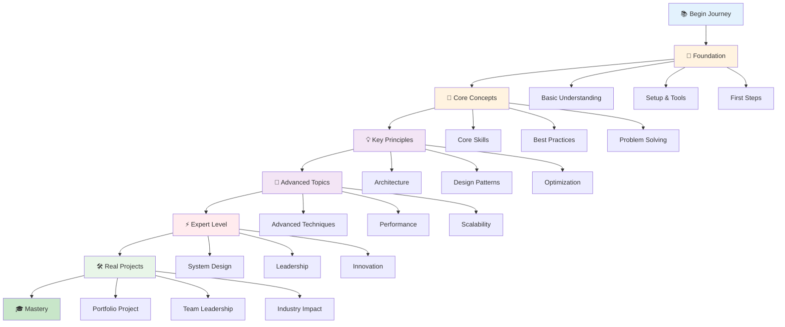
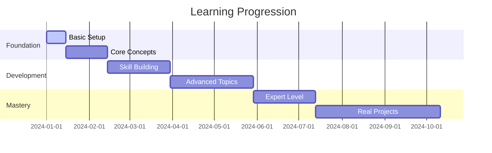

# Getting Started

## Learning Path Overview

## Timeline & Milestones

Welcome to your learning journey! This documentation will guide you through everything you need to know, from the basics to advanced concepts.
