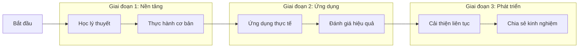

# 🎯 1.1 Mục tiêu học tập

## Mục tiêu tổng quan của khóa học

Khóa học "Ứng dụng AI vào Giảng dạy" được thiết kế với mục tiêu giúp các nhà giáo dục nắm vững và áp dụng hiệu quả công nghệ Trí tuệ Nhân tạo vào hoạt động giảng dạy của mình.

## 🎓 Mục tiêu kiến thức

### 1. Hiểu biết cơ bản về AI
- **Khái niệm cơ bản**: Nắm vững định nghĩa, nguyên lý hoạt động của AI
- **Lịch sử phát triển**: Tìm hiểu quá trình phát triển của AI từ quá khứ đến hiện tại
- **Phân loại AI**: Phân biệt các loại AI khác nhau và ứng dụng của chúng
- **Xu hướng tương lai**: Dự báo những phát triển của AI trong giáo dục

### 2. AI trong bối cảnh giáo dục
- **Vai trò của AI**: Hiểu được AI có thể hỗ trợ giáo dục như thế nào
- **Lợi ích và thách thức**: Đánh giá toàn diện về AI trong giáo dục
- **Nghiên cứu thực tế**: Tìm hiểu các nghiên cứu và ví dụ thành công
- **Đạo đức AI**: Hiểu về vấn đề đạo đức khi sử dụng AI trong giáo dục

## 🛠️ Mục tiêu kỹ năng

### 1. Sử dụng công cụ AI
- **Công cụ tạo nội dung**: ChatGPT, Claude, Gemini cho việc soạn thảo
- **Công cụ thiết kế**: Canva AI, DALL-E, Midjourney cho tạo hình ảnh
- **Công cụ đánh giá**: AI-powered quiz tools, feedback systems
- **Công cụ quản lý lớp học**: AI chatbots, learning management systems

### 2. Tích hợp AI vào giảng dạy
- **Soạn giáo án**: Sử dụng AI để tạo kế hoạch bài học chi tiết
- **Tạo tài liệu**: Phát triển bài tập, đề thi, slide thuyết trình
- **Cá nhân hóa học tập**: Tạo ra nội dung phù hợp với từng học sinh
- **Theo dõi tiến độ**: Sử dụng AI để monitor quá trình học tập

### 3. Đánh giá và cải tiến
- **Phân tích dữ liệu**: Hiểu được hiệu quả của việc sử dụng AI
- **Thu thập phản hồi**: Đánh giá phản ứng của học sinh
- **Điều chỉnh phương pháp**: Cải thiện liên tục cách sử dụng AI
- **Chia sẻ kinh nghiệm**: Truyền đạt kiến thức cho đồng nghiệp

## 🎯 Mục tiêu ứng dụng

### 1. Tự tin sử dụng AI
- **Vượt qua nỗi sợ công nghệ**: Tự tin tiếp cận và sử dụng AI
- **Tư duy sáng tạo**: Phát triển khả năng tạo ra ý tưởng mới với AI
- **Giải quyết vấn đề**: Sử dụng AI để giải quyết thách thức giảng dạy
- **Học tập liên tục**: Duy trì thói quen cập nhật kiến thức về AI

### 2. Ảnh hưởng tích cực
- **Nâng cao chất lượng giảng dạy**: Tạo ra trải nghiệm học tập tốt hơn
- **Tiết kiệm thời gian**: Sử dụng AI để tối ưu hóa công việc
- **Tăng tương tác**: Tạo ra môi trường học tập tích cực hơn
- **Chuẩn bị cho tương lai**: Giúp học sinh sẵn sàng cho thời đại AI

## 📊 Cách đánh giá mục tiêu

### Tiêu chí đánh giá kiến thức
- [ ] **Quiz và câu hỏi**: Kiểm tra hiểu biết lý thuyết về AI
- [ ] **Thảo luận**: Tham gia thảo luận về các chủ đề AI trong giáo dục
- [ ] **Case study**: Phân tích các tình huống thực tế
- [ ] **Reflection**: Viết reflections về quá trình học tập

### Tiêu chí đánh giá kỹ năng  
- [ ] **Hands-on practice**: Thực hành sử dụng các công cụ AI
- [ ] **Project**: Tạo ra sản phẩm giảng dạy sử dụng AI
- [ ] **Presentation**: Trình bày về cách sử dụng AI trong lớp học
- [ ] **Peer review**: Đánh giá lẫn nhau về việc sử dụng AI

### Tiêu chí đánh giá ứng dụng
- [ ] **Portfolio**: Tạo ra bộ sưu tập các tài liệu được tạo bằng AI
- [ ] **Implementation plan**: Lập kế hoạch áp dụng AI vào lớp học
- [ ] **Feedback collection**: Thu thập phản hồi từ học sinh
- [ ] **Improvement plan**: Đưa ra kế hoạch cải thiện liên tục

## 🚀 Lộ trình đạt mục tiêu

## 💡 Lời khuyên để đạt mục tiêu

1. **Học từng bước**: Không vội vàng, hãy nắm vững từng phần
2. **Thực hành thường xuyên**: Practice makes perfect
3. **Đặt câu hỏi**: Không ngại hỏi khi gặp khó khăn
4. **Chia sẻ kinh nghiệm**: Học hỏi từ cộng đồng
5. **Kiên trì**: AI là công nghệ mới, cần thời gian để thành thạo

---

**Tiếp theo**: [👥 Đối tượng học](/introduction/doi-tuong) - Xem khóa học có phù hợp với bạn không