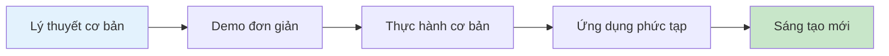

# 📚 1.4 Phương pháp học tập

## Tối ưu hóa quá trình học AI

Học về AI và ứng dụng vào giảng dạy đòi hỏi phương pháp tiếp cận khác biệt so với học truyền thống. Đây là hướng dẫn để bạn có thể học hiệu quả nhất.

## 🧠 Nguyên tắc học tập hiệu quả

### 1. Học bằng thực hành (Learning by Doing)
**Tại sao quan trọng:**
- AI là công nghệ, chỉ hiểu được khi thực hành
- Mỗi công cụ có interface và workflow riêng
- Kinh nghiệm thực tế giúp ghi nhớ lâu hơn

**Cách áp dụng:**
- Thực hành ngay sau khi học lý thuyết
- Thử nghiệm với dữ liệu thực tế của bạn
- Làm bài tập hands-on thường xuyên
- Tạo ra sản phẩm cụ thể từ mỗi bài học

### 2. Học tích cực (Active Learning)
**Thay vì:** Đọc/nghe thụ động
**Hãy:** Đặt câu hỏi, thảo luận, áp dụng

**Strategies:**
- Ghi chú bằng cách tóm tắt lại bằng từ ngữ của bạn
- Giải thích cho người khác những gì bạn vừa học
- Tạo ra examples mới từ concepts đã học
- Challenge các ideas và tìm counter-examples

### 3. Học từng bước (Incremental Learning)
**Cấu trúc:**

**Lưu ý:**
- Không vội vàng chuyển sang bước tiếp theo
- Đảm bảo nắm vững bước hiện tại
- Review và consolidate thường xuyên

## 🎯 Strategies cho từng loại nội dung

### 📖 Đối với nội dung lý thuyết

**Pre-reading:**
- [ ] Đọc tổng quan trước khi đi sâu
- [ ] Xác định những gì bạn đã biết
- [ ] Đặt ra 3-5 câu hỏi muốn tìm hiểu

**During reading:**
- [ ] Ghi chú key points bằng bullet points
- [ ] Tạo mind map để visualize concepts
- [ ] Pause để reflect sau mỗi section
- [ ] Tìm connections với kinh nghiệm của bạn

**Post-reading:**
- [ ] Summarize main ideas trong 2-3 câu
- [ ] Viết xuống 3 actionable insights
- [ ] Chia sẻ với đồng nghiệp hoặc cộng đồng

### 🛠️ Đối với nội dung thực hành

**Preparation:**
- [ ] Chuẩn bị tools và accounts cần thiết
- [ ] Đọc overview của exercise
- [ ] Chuẩn bị sample data nếu cần

**During practice:**
- [ ] Follow từng bước một cách cẩn thận
- [ ] Screenshot các bước quan trọng
- [ ] Note lại các settings và parameters
- [ ] Thử experiment với variations

**After practice:**
- [ ] Document những gì bạn đã làm
- [ ] Identify potential improvements
- [ ] Plan cho next practice session
- [ ] Share results với community

### 💬 Đối với discussions và Q&A

**Preparation:**
- [ ] Chuẩn bị questions thoughtful
- [ ] Review materials liên quan
- [ ] Think về personal experiences để chia sẻ

**Participation:**
- [ ] Listen actively to others
- [ ] Ask follow-up questions
- [ ] Share specific examples
- [ ] Respectful disagreement khi cần

**Follow-up:**
- [ ] Take notes về insights từ discussion
- [ ] Research thêm về topics thú vị
- [ ] Apply suggestions vào practice của bạn

## 📅 Lên lịch học tập hiệu quả

### Phân bổ thời gian hàng tuần

**Lý tưởng cho Regular learner (6-8 tiếng/tuần):**

```mermaid
gantt
    title Lịch học tập tuần
    dateFormat  HH:mm
    axisFormat %H:%M
    
    section Thứ 2
    Lý thuyết mới    :09:00, 90m
    
    section Thứ 4  
    Thực hành       :09:00, 120m
    
    section Thứ 6
    Review + Q&A    :09:00, 60m
    
    section Chủ nhật
    Project work    :14:00, 180m
```

**Tips cho scheduling:**
- Học vào cùng thời điểm mỗi ngày để tạo thói quen
- Chia nhỏ sessions (45-90 phút mỗi lần)
- Schedule breaks 10-15 phút giữa các sessions
- Reserve thời gian cuối tuần cho review

### Cycle học tập tuần

**Week Pattern:**
1. **Day 1-2**: Học content mới
2. **Day 3-4**: Thực hành và apply
3. **Day 5**: Review và consolidate
4. **Day 6-7**: Project work và creative application

## 🧘‍♂️ Mindset và Motivation

### Growth Mindset for AI Learning

**Thay vì nghĩ:** "Tôi không giỏi công nghệ"
**Hãy nghĩ:** "Tôi đang học cách sử dụng công nghệ hiệu quả hơn"

**Thay vì:** "AI quá phức tạp"
**Hãy:** "AI là tool, tôi chỉ cần học cách sử dụng"

**Thay vì:** "Tôi sẽ bị thay thế bởi AI"
**Hãy:** "Tôi sẽ trở nên powerful hơn với AI"

### Dealing với Challenges

**Khi gặp khó khăn:**
1. **Pause và breath**: Đừng frustration
2. **Break down problem**: Chia nhỏ thành steps
3. **Seek help**: Hỏi community, search online
4. **Try different approach**: Có nhiều cách giải quyết
5. **Celebrate small wins**: Acknowledge progress

**Khi cảm thấy overwhelmed:**
- Focus vào 1 concept/tool tại một thời điểm
- Tạo personal examples thay vì generic ones
- Connect với real teaching situations của bạn
- Remember your "why" - tại sao bạn học khóa này

## 🤝 Tận dụng cộng đồng

### Online Community Best Practices

**Khi ask questions:**
- Be specific về problem bạn gặp
- Share screenshot hoặc examples
- Explain những gì bạn đã try
- Show appreciation cho answers

**Khi answer questions:**
- Share personal experience
- Provide step-by-step guidance
- Suggest alternatives
- Encourage learning journey

**Networking:**
- Connect với people có similar interests
- Join study groups hoặc create your own
- Attend virtual meetups về AI in Education
- Share your projects và learnings

## 📱 Tools hỗ trợ học tập

### Note-taking và Organization
- **Notion**: All-in-one workspace cho notes, projects
- **Obsidian**: Linked note-taking với graph view
- **Google Docs**: Collaboration và sharing
- **Evernote**: Web clipping và organization

### Practice và Experimentation
- **Google Colab**: Free environment cho AI experiments
- **Replit**: Online coding environment
- **GitHub**: Version control cho projects
- **Loom**: Screen recording cho documentation

### Time Management
- **Toggl**: Time tracking cho study sessions
- **Forest**: Focus app với pomodoro technique
- **Google Calendar**: Scheduling và reminders
- **Notion**: Task management và progress tracking

## 📊 Theo dõi tiến độ

### Weekly Self-Assessment

**Knowledge Check:**
- [ ] Tôi có thể explain concepts mới bằng ngôn ngữ đơn giản
- [ ] Tôi có thể give examples từ teaching experience của mình
- [ ] Tôi có thể identify khi nào nên dùng tool nào

**Skill Check:**
- [ ] Tôi có thể use tools được học trong tuần
- [ ] Tôi có thể troubleshoot common problems
- [ ] Tôi có thể adapt tools cho specific needs

**Application Check:**
- [ ] Tôi đã try apply concepts vào real teaching situation
- [ ] Tôi có ideas cụ thể cho implementation
- [ ] Tôi có thể share experience với others

### Monthly Review Questions

1. **Progress**: Những gì tôi đã học được trong tháng này?
2. **Challenges**: Obstacles nào tôi đã overcome?
3. **Applications**: Tôi đã apply AI vào teaching như thế nào?
4. **Next steps**: Mục tiêu cho tháng tiếp theo?
5. **Adjustments**: Tôi cần adjust learning approach như thế nào?

## 🎓 Chuyển từ Learning sang Mastery

### Levels of Competency

**🌱 Beginner (Tháng 1-2)**
- Familiar với basic concepts
- Can use tools với guidance
- Understand potential applications

**🌿 Intermediate (Tháng 3-4)**
- Independent tool usage
- Adapt tools cho specific needs
- Create basic AI-assisted content

**🌳 Advanced (Tháng 5-6)**
- Integrate multiple tools effectively
- Train others on AI usage
- Innovate new applications

**🏆 Expert (Tháng 6+)**
- Lead AI initiatives in education
- Contribute to AI education community
- Develop new methodologies

### Transition Strategies

**Từ Beginner sang Intermediate:**
- Practice daily với real teaching materials
- Join advanced discussions
- Take on mini-leadership roles

**Từ Intermediate sang Advanced:**
- Mentor newcomers
- Contribute to community resources
- Experiment với cutting-edge tools

**Từ Advanced sang Expert:**
- Publish experiences và insights
- Speak at conferences
- Collaborate với AI developers

---

**Sẵn sàng bắt đầu?** Hãy chuyển sang [🤖 Cơ bản về AI](/ai-basics/ai-la-gi) để bắt đầu hành trình học tập!